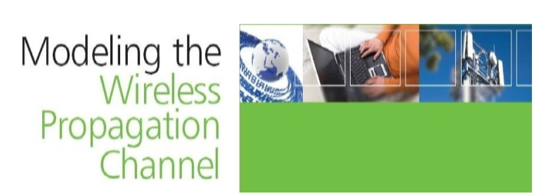

# Modeling the Wireless Propagation Channel

## Introduction

This book deals with several issues related to the wireless propagation channel using a simulation approach. This means thatwe will be generating synthetic, but realistic, series of relevant propagation parameters as a function of time or traversed distance. It is hoped that this will allow the reader to become acquainted with this topic in a simpler, more intuitive way than by using cumbersome mathematical formulations. This will be done in a step-by-step fashion whereby new concepts will be presented as we progress in our familiarization process with the wireless propagation channel.

This book will reproduce the characteristics of the wanted and interfering signals and especially their dynamics. Thus, time series will be generated in most of the projects proposed. Sometimes, the term ‘time series’ will be used indistinctly for series with the abscissas in time units and in length units (traveled distance), thus explicitly showing the time and/or location variability in the received signal, or in the propagation channel parameters of interest: power, voltage, phase, attenuation, frequency response, impulse response, etc. The procedure followed in all chapters will be to first define a propagation scenario, either statistically or geometrically, then generate one or several time series and, finally, perform a statistical analysis of the produced series, in order to extract relevant parameters from which conclusions may be drawn. Only in Chapter 1 we will be using series already produced using simulators from other chapters.

## Content features

Part of the proposed material currently complements a lecture on Mobile Communications Systems corresponding to the fifth year of a Telecommunications Engineering course (Masters degree) at the University of Vigo, Spain. This lecture is complemented by simulation work carried out during one semester in sessions of two hours per week, where several issues related to the mobile radio channel and, in general, to any radio channel are studied by means of simulations carried out in Matlab.

This book covers a number of issues related to the mobile or wireless propagation channel on a step-by-step basis, where we briefly introduce the needed theoretical background relevant to the topic at the beginning of each chapter. This book is not intended as a theoretical book with a full coverage of the various fundamental concepts, and existing models. It is rather a complement to such books. A thorough coverage of the various topics discussed in this book can found in some of the books mentioned in the References of the various chapters.

 This book is structured as follows: first a brief theoretical background is provided, then a number of simulation projects are proposed. In some cases, further theoretical background relative to each specific project is provided. Then, we go on to describe the simulation approach followed. The basic result in each simulation is a synthetic series. This is further processed to obtain a number of statistical parameters, e.g., a cumulative distribution. The obtained results are commented upon to point out the underlying concepts, and the influence of the inputs employed. The codes for all projects will be provided by the authors on request, see email addresses below. The reader is also prompted to change the inputs to observe the influence of such changes in the obtained results. Sometimes, the reader is also encouraged to modify the code provided to implement other algorithms not included in the text. Each chapter ends with a list of references, and the list of Matlab scripts and functions used.

## Installation and configuration

The Matlab software developed is not totally optimized, since the main objective is that the algorithms implemented can be better understood by the reader. Such programs can also be modified by the reader and used in the development of more complex simulators.

If the reader identifies problems in the software, he or she is encouraged to report them to the authors (fpfontan@tsc.uvigo.es) so that we can make the required updates or provide solutions. Readers can contact the above email addresses so that we can supply them with the ftp address (or alternative means) for downloading the software. We have used version 7 of Matlab, and the programs may not work on earlier versions. Matlab's signal processing toolbox should also be available for a proper operation of the programs supplied.

## Who is targeted?

We recommend this book for different types of readers going through different stages in their process to approaching the wireless propagation channel. Possible readers include senior undergraduates, and first-year graduate instructors and students for complementing their lecture materials with a practical, simulation-based book. The Matlab functions and scripts provided should allow them to quickly step through the first learning phases. The programs provided could help these students in developing their own programs, for example, for their project and thesis work. The material supplied could also be of interest to first-year Ph.D. students.

Other potential readers could be the self-learning professionals who need to get acquainted with this topic by first gaining a good intuitive insight into the wireless channel. In a second step, these readers could go on and approach other texts where more thorough mathematical and statistical developments of the various phenomena are available.

Other possible readers are practicing engineers who are involved in projects where the dynamics of the channel need to be included in their studies. System engineers who work on the definition of the transmission scheme needed for a new system under development, where a good understanding of the basic propagation phenomena is needed, can find the help they may require on the channel dynamics in this book.

## Table of contents

### 1. Introduction to Wireless Propagation

We present a brief introduction to the basic concepts and mechanisms driving the wireless propagation channel. Then, we present very simple time-series analysis techniques which cover the basics previously introduced. These include the fast variations due to multipath and the combined effects of shadowing and multipath. Finally, we have a look into the signal's complex envelope, and we plot its magnitude and phase. We also present the Rayleigh and Rice cases which correspond to harsh and benign propagation conditions.

Code: [Cap. 01: Introduction to Wireless Propagation.](https://github.com/RadioPropagationChannel/Wiley-Modeling-the-Wireless-Propagation-Channel/tree/main/code/Cap01_Introduction%20to%20Wireless%20Propagation)

### 2.  Shadowing Effects

We present several techniques for quantifying the shadowing effects caused by totally absorbing screens. Even though the formulations presented are somehow more involved than those in other chapters, we have thought it helpful to provide the reader with tools to reproduce the effect of the presence of buildings and other large obstacles. In this way, the reader will be able to replicate the effects of the terrain or the signal variations while driving along a street. We also wanted to point out that, through fairly simple physical models, it is possible to reproduce the inherent cross-correlation properties observed between wanted or interfering signals converging on a given mobile terminal.

Code: [Cap. 02: Shadowing Efects.](https://github.com/RadioPropagationChannel/Wiley-Modeling-the-Wireless-Propagation-Channel/tree/main/code/Cap02_Shadowing%20Effects)

### 3. Coverage and Interference 

Looks into the shadowing phenomenon from a statistical point of view. In Chapter 2 we looked at it from a deterministic point of view. We provide a number of simulation cases where the various aspects of shadowing are presented, thus, we first look at the normal distribution describing the variability of shadowing effects when expressed in dB, and we link the mean of the distribution to the path loss. We define two additional concepts, the location variability and the correlation length. We present alternative ways of reproducing such variations. We then present the effect of cross-correlation, and how to introduce it in simulated series using a statistical approach. Finally, we introduce the multiple interference case. We also use the generated series in hard- and soft-handover examples.

Code: [Cap. 03: Coverage and Interference.](https://github.com/RadioPropagationChannel/Wiley-Modeling-the-Wireless-Propagation-Channel/tree/main/code/Cap03_Coverage%20and%20Interference)
                                                                                                                                                                                                                                                                                                                                                                           
### 4. Introduction to Multipath
                    
After studying the shadowing effects, we start the analysis of the multipath phenomenon. This is introduced by presenting first, very simple geometries, and continuing with more intricate ones. We point out how multipath is a time-selective phenomenon, i.e., it gives rise to fades. In addition, the movement of at least one of the terminals causes Doppler effects. We see how the Doppler shift and the angle of arrival of a given echo are interrelated, and that there is a limit to the maximum rate of change possible, if it is only the terminal that is moving. Throughout, we assume that multipath gives rise to a spatial standing wave, sensed by the terminal antenna as it moves. We also show a possible way of generating time variations when the mobile terminal is stationary. Finally, we briefly introduce the case where both terminals, and even the scatterers, are moving. In this chapter, and throughout this book, we use a very simple approach for the multipath channel based on the so-called multiple point-scatterer model.
 
Code: [Cap. 04: Introduction to Multipath.](https://github.com/RadioPropagationChannel/Wiley-Modeling-the-Wireless-Propagation-Channel/tree/main/code/Cap04_Introduction%20to%20Multipath)
                                                                                                                                                                                                   
### 5. Multipath: Narrowband Channel

We continue our discussion on the narrowband multipath channel. In this case, we go one step further and use normalized levels so that we are able to introduce our synthetic time series in actual link-level simulators, where the working point (the average signal-to-noise ratio) is extremely important. We continue our discussion using the multiple point-scatterer model to simulate second-order statistics, and other parameters. We then introduce in the model a direct ray, thus generating a Rice series. Afterward, we present alternative ways for generating Rayleigh and Rice series, one consisting in an array of low frequency sinusoidal generators, and the other consisting on the combination in quadrature of two random Gaussian, noise-like signals, which are also filtered to force the wanted Doppler characteristics. Finally, we look into the issue of space diversity, both at the mobile and the base station sides. The concept of diversity gain/improvement is introduced.
 
Code: [Cap. 05: Narrowband channel.](https://github.com/RadioPropagationChannel/Wiley-Modeling-the-Wireless-Propagation-Channel/tree/main/code/Cap05_Multipath.-%20Narrowband%20channel)

### 6. Shadowing and Multipath

We conclude our analysis of the narrowband channel by modeling together the slow and fast variations due to shadowing and multipath, respectively. We present two mixed distributions: Suzuki and Loo. We also simulate a very simple power control technique.
  
Code: [Cap. 06: Shadowing and Multipath.](https://github.com/RadioPropagationChannel/Wiley-Modeling-the-Wireless-Propagation-Channel/tree/main/code/Cap06_Shadowing%20and%20Multipath)
                                                                                                                                                                                                                                                                                                                                                                                                                                           
### 7. Wideband Channel

Completes our picture of the channel. When the time spreading is significant with respect to the duration of the transmitted symbols, selective fading starts to be important. We introduce techniques for characterizing wideband channels, starting with deterministic time-varying channels, and then going on to introduce the stochastic characterization. The main functions and parameters necessary are discussed. We put the wideband channel in the frame of the multiple point-scatterer model, which has been used for presenting illustrative channel simulations. Finally, a statistical model, that of COST 207, is implemented.
 
Code: [Cap. 07: Multipath.- Wideband Channel.](https://github.com/RadioPropagationChannel/Wiley-Modeling-the-Wireless-Propagation-Channel/tree/main/code/Cap07_Multipath.-%20Wideband%20Channel)
                                                                                                                                                                                                   
### 8. Propagation in Microcells and Picocells

We review several issues of relevance for the microcell and picocell scenarios. We also consider the outdoor-to-indoor propagation case. In addition to reviewing some basic theoretical and empirical techniques, we propose and implement simulations which deal with the modeling of these scenarios using simple, image-theory ray-tracing techniques, which reproduce what empirical models forecast. Moreover, we introduce the consideration of diffraction effects in these scenarios. Finally, we also present a widespread statistical model due to Saleh and Valenzuela for describing the wideband indoor channel, where we present the concept of ray clustering.
 
Code: [Cap. 08: Propagation in Microcells and Picocells.](https://github.com/RadioPropagationChannel/Wiley-Modeling-the-Wireless-Propagation-Channel/tree/main/code/Cap08_Propagation%20in%20Microcells%20and%20Picocells)
                                                                                                                                                                                                   
### 9. The Land Mobile Satellite Channel

We become acquainted with some of the issues specific to this channel, and its more common modeling techniques. We present alternative ways for generating time series, i.e., using a fully statistical approach based on Markov chains, and a mixed statistical-deterministic approach, called here the virtual city approach. Additionally, we become familiar with simple techniques for assessing multiple satellite availability by making use of constellation simulator data, together with urban masks. Finally, we quantify the Doppler shift caused by non-GEO satellites.
 
Code: [Cap. 09: The Land Mobile Satellite Channel.](https://github.com/RadioPropagationChannel/Wiley-Modeling-the-Wireless-Propagation-Channel/tree/main/code/Cap09_The%20Land%20Mobile%20Satellite%20Channel)

### 10. The Directional Wireless Channel

Concludes our study on the wireless channel. Here we study the spatial properties of the multipath channel. We first learn how scatterer contributions tend to be clustered in terms of excess delays, which indicate that they can belong to the same obstacle. We also see that these clustered contributions are spread out in angle of arrival and departure. We also simulate the multiple antenna channel (MIMO, multiple-input multiple-output) using our point-scatterer approach and we show how the capacity can be increased substantially. Finally, we present another approach, a statistical one, for simulating the MIMO channel.
 
Code: [Cap. 10: The Directional Wireless Channel.](https://github.com/RadioPropagationChannel/Wiley-Modeling-the-Wireless-Propagation-Channel/tree/main/code/Cap10_The%20Directional%20Wireless%20Channel)
                                                                                                                                                                                                   

## Contact

Fernando Pérez Fontán 

atlanTTic Research Center,

School of Telecommunication Engineering,

Departament of Signal Theory and Comunications,

University of Vigo

36200 Vigo, Spain

fpfontan@tsc.uvigo.es
Tel: +34 986 812137

## Acknowledgments

We would like to specially thank Professor José María Hernando for the opportunities provided through the years, especially, working with and learning from him. To Bertram Arbesser-Rastburg and Pedro Baptista, the use of the multiple point-scatterer model comes from that time. Also thanks to two great colleagues and friends, Erwin Kubista and Uwe Fiebig. Finally, thanks to our colleagues here at the University of Vigo, especially Iria Sanchez and Belén Sanmartín who did a lot of the programming and reviewing, but also to our other colleagues Adolfo (Fito) Nuñez, Pavel Valtr, Ana Castro, Fernando Machado and Vicente Pastoriza.

